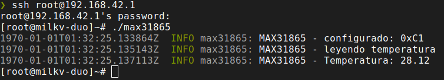
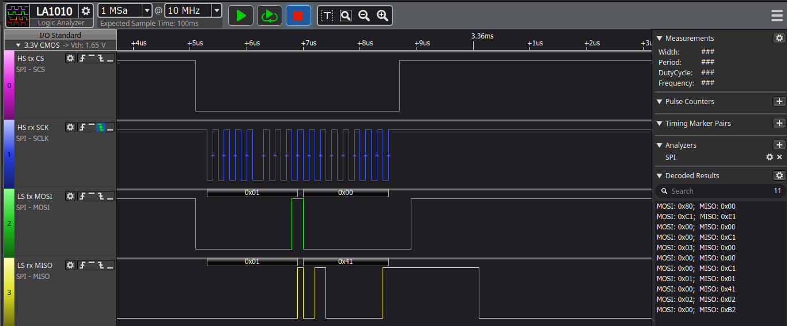

# Rust-Max31865 with Embedded_Hal

# Description

SPI test for linux 

This project contains the following elements:
- Milk-V Duo
- Max31862 Three wired sensor
- Rust
  - embedded_hal
  - linux_embedded_hal

# Install

```bash
sudo apt-get install build-essential
sudo apt-get install libc6-dev-riscv64-cross
sudo apt-get install gcc-riscv64-linux-gnu
```

# Execute

```bash
./build
```

# Captures



